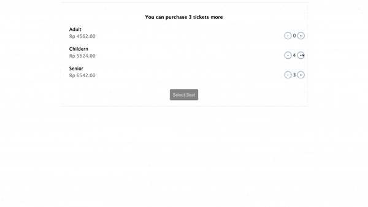

#React cart page example



#How to 
1. ``` npm install ```
2. ``` npm start ```

#Description

This is react cart page example, where user can add or remove product from cart on basis of max number of quantity allowed to purchase. Free to fork and improve the existing logic and send merge request. 